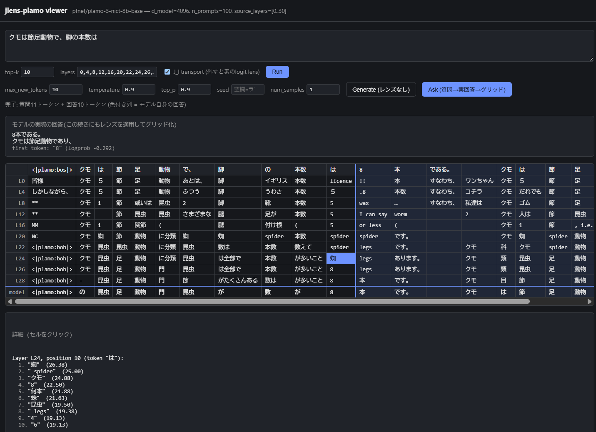

# jlens-plamo

> This is not evidence of consciousness. This is not proof that PLaMo has a Claude-like
> global workspace. This is not yet a robust reproduction of the Anthropic paper.

A Japanese-language reproduction of Anthropic's [Jacobian Lens (J-lens)](https://transformer-circuits.pub/2026/workspace/index.html)
on [`pfnet/plamo-3-nict-8b-base`](https://huggingface.co/pfnet/plamo-3-nict-8b-base) (32 layers, GQA,
Gemma-style SWA/full-attention hybrid, no GDN), with an original extension: probing whether
haiku lookahead planning (kigo / kireji / mora count) is visible through J-space.



## Status

**Demo-quality, research preview.** This is a hobbyist reproduction, not a research-grade
replication of the Anthropic paper. See [Limitations](#limitations) below.

## Quick start

```bash
uv sync
# Agree to the PLaMo Community License on Hugging Face first, then:
uv run hf auth login

# Phase 2 — build the fitting corpus
uv run python data/corpus/build_corpus.py --config data/corpus/config.yaml

# Phase 3 — fit the lens (multi-hour GPU job; see data/lens/README.md for the recipe used)
uv run python scripts/run_fit.py

# Phase 4 — apply the fitted lens: layer x position top-k readout
uv run python -m jlens_plamo.apply "県庁所在地が松山である県は" --layers 16,20,24,28,30

# Phase 5 — self-contained slice-grid UI (haiku probe set not required to explore arbitrary prompts)
uv sync --extra web
uv run uvicorn web.app:app --port 8420
# then open http://localhost:8420/
```

`uv sync` pulls a CUDA-12.9-linked (`cu129`) torch build (see
[Environment notes](#environment-notes--known-compatibility-issues) below) — if your GPU driver
supports a different CUDA version, adjust the `[[tool.uv.index]]` entry in `pyproject.toml`
accordingly. Always load the model via `jlens_plamo.model_loading.load_plamo()`, not
`AutoModelForCausalLM.from_pretrained()` directly — see the same section for why.

## How it works

The Jacobian lens reads out what a mid-layer residual-stream activation is "disposed to say"
by linearly transporting it into the final-layer basis with a layer-averaged Jacobian `J_ℓ`,
then decoding it with the model's own unembedding into a ranked list of vocabulary tokens.
`J_ℓ` is fit (not hand-derived) from a corpus of ordinary text by summing cotangents at the
target position and averaging over source positions — the fitting and application logic here
is provided by [`anthropics/jacobian-lens`](https://github.com/anthropics/jacobian-lens) and is
not reimplemented.

The fitting corpus is mostly [`HuggingFaceFW/fineweb-2`](https://huggingface.co/datasets/HuggingFaceFW/fineweb-2)
(`jpn_Jpan` config) with a Japanese Wikipedia supplement for long-document coherence. Haiku data
is kept out of the fitting corpus entirely and used only as a held-out probe set (see
`data/probes/`).

## Demos

Real output from the fitted `data/lens/lens.pt` (see `data/lens/README.md`), reproducible via
`uv run python -m jlens_plamo.apply "<prompt>" --layers ...` — not cherry-picked beyond this.

- **Two-step reasoning**: `県庁所在地が松山である県は` ("the prefecture whose capital is
  Matsuyama") → `愛媛県` is the top readout from layer 20 onward, matching the model's own answer.
- **Spider → legs, Japanese analogue** of the paper's headline example: `クモは節足動物で、脚の本数は`
  → `8` is the top readout by layer 28, two layers before the model's own final answer.
- **Cross-lingual concept binding**: `パリはフランスの首都です。日本の首都は` — layer 20 briefly
  surfaces English `" Paris"` at the French-capital's own position, in an otherwise all-Japanese
  prompt, and `東京` tops the final position.

Three hand-picked prompts, not a systematic evaluation — see [Limitations](#limitations).

The web UI's "Ask" button extends this to free-form chat: the model generates a real answer
(`model.generate()`, with optional `temperature`/`top_p`/`seed`/`num_samples` sampling controls),
and the same layer-readout grid is computed over the whole question+answer exchange, not just the
prompt.

## Project layout

```
data/corpus/    fitting corpus builder + config.yaml (recipe, not raw text)
data/probes/    held-out haiku probe set + loader
data/lens/      fitted lens artifacts (not committed) + fitting README
jlens_plamo/    apply / intervention library
scripts/        run_fit.py and other one-off scripts
web/            FastAPI backend + self-contained HTML slice-grid viewer
```

## Environment notes / known compatibility issues

Four real incompatibilities between `pfnet/plamo-3-nict-8b-base`'s `trust_remote_code` model and
this stack — none the SWA/GDN autograd concern originally anticipated. All worked around already;
use `jlens_plamo.model_loading.load_plamo()`, not `AutoModelForCausalLM.from_pretrained()`
directly, or you'll hit them. Full technical detail in that module's docstring (issues 1–3) and
`web/app.py` (issue 4).

1. **`jlens.from_hf()` can't auto-detect PLaMo-3's decoder layout** (`model.model.layers` is a
   wrapper, not the block list) — worked around with a custom `LensModel` adapter
   (`jlens_plamo/plamo_adapter.py`); jlens's own fitting/application math is untouched.
2. **`transformers>=5.5` tied-weights format mismatch** — PLaMo's modeling file still uses the
   pre-5.5 `_tied_weights_keys` list form; patched to the dict form at import time.
3. **RoPE buffer corruption on load, worth knowing about if you hit unexplained NaNs** — some
   layers' `inv_freq`/`cos_cached`/`sin_cached` buffers can load as uninitialized garbage under
   `from_pretrained`'s meta-device path. Looks like an upstream `transformers`/`accelerate` bug,
   not PLaMo- or jlens-specific. `load_plamo()` unconditionally rebuilds them after loading.
4. **`model.generate()` crashes** (`TypeError: 'Plamo3Cache' object is not subscriptable`) under
   this `transformers` version's Cache API — only affects the web UI's generation endpoints, not
   fitting/lens application. Worked around with `use_cache=False`.

Separately, `uv sync` pins `torch` to the `cu129` wheel index (see `pyproject.toml`) for this
project's dev GPU (RTX 5090, driver 576.88, CUDA 12.9) — adjust or remove that pin for other
hardware/drivers.

## Limitations

- Fitting corpus is n=100 prompts, vs. the paper's n=1000 — readouts may be noisy at this scale
  (see `data/lens/README.md`).
- Corpus filtering uses simple heuristics, not a learned classifier; a human review caught and
  removed bad documents across two iterations, and one known-noisy document was knowingly kept.
- PLaMo's SWA/full-attention autograd was verified correct (Phase 3a) — see
  [Environment notes](#environment-notes--known-compatibility-issues) for what it did catch.
- Haiku lookahead probing (Phase 5) is an original extension, not part of the Anthropic paper;
  findings are reported honestly as noisy-but-interpretable, not a robust result.
- The [Demos](#demos) are three hand-picked prompts, not a systematic evaluation —
  `data/lens/README.md` keeps a fourth, noisier example for balance.

## Acknowledgements

- [`anthropics/jacobian-lens`](https://github.com/anthropics/jacobian-lens) — the fitting and
  application logic this project depends on and does not reimplement.
- [`WeZZard/jlens-qwen36`](https://github.com/WeZZard/jlens-qwen36) — corpus loader design, UI,
  and project layout reference.

## License

Code is Apache-2.0 (see `LICENSE`), matching `anthropics/jacobian-lens`.

`pfnet/plamo-3-nict-8b-base` itself is distributed under the separate
[PLaMo Community License](https://huggingface.co/pfnet/plamo-3-nict-8b-base) — not Apache-2.0.
Per that license: outputs/derivatives must display "Built with PLaMo" where applicable, and
commercial use above the license's revenue threshold requires a separate commercial agreement
(see the license page for current terms). Read the license on the model page before commercial
use.

Raw corpus text (fineweb-2, Wikipedia) is never committed to this repository — only
`data/corpus/config.yaml` and `data/corpus/build_corpus.py`, which regenerate an equivalent
corpus deterministically via a fixed seed.
